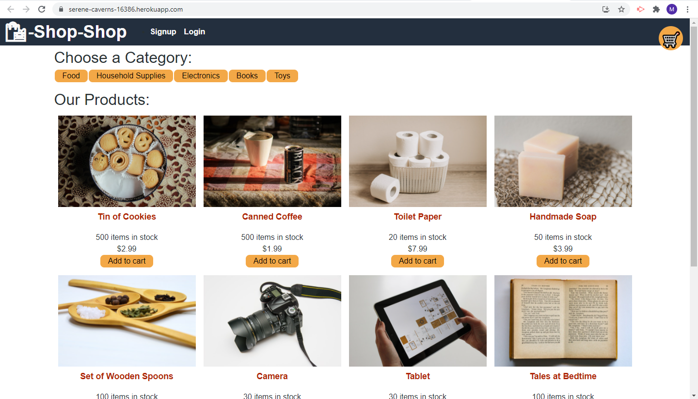

 
  # Shop-shop
  

  ## Table of Contents
  * [Description](#description)
  * [Install](#install)
  * [Use](#use)
  * [License](#license)
  * [Contributing](#contributing)
  * [Tests](#tests)
  * [Questions](#questions)

  ## Description
  This is a full stack MERN website for an online shopping store front that gives visitors the option to pay through a Stripe system.

  ## Install
  Download the files and install the appropriate node packages found in the dependencies with "npm install". Use the command "npm run develop" in the root folder to launch the website in development mode. A deployed site can be found below:
  

  [Deployed Site](https://serene-caverns-16386.herokuapp.com/)  
  ## License
  No license.

  ## Contributing
  

  ## Tests
  Use the command "npm run test" within the client folder to test the reducer functions.
  
  ## Questions
  - [Github for mattersievers](http://www.github.com/mattersievers)
  - For further questions, contact me through email at mattersievers@gmail.com

